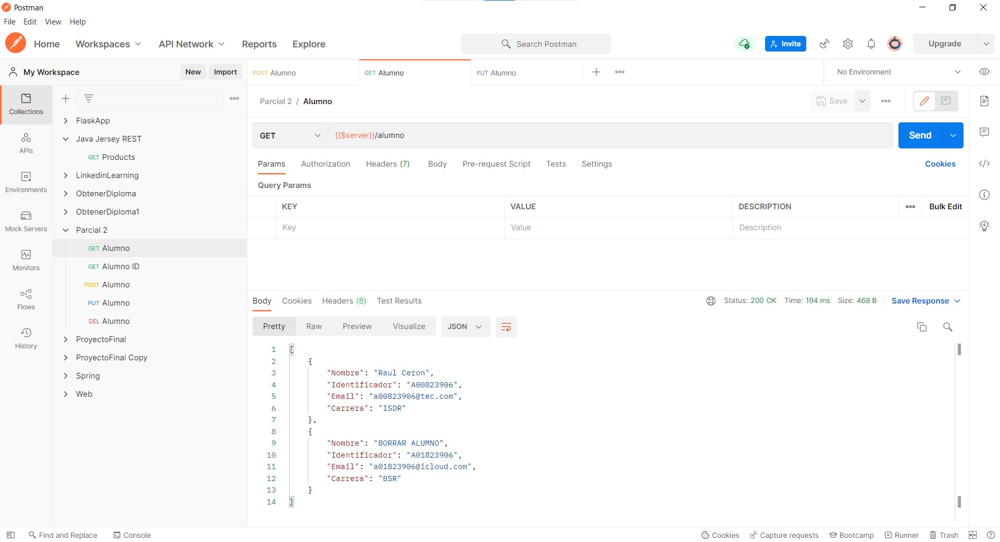

# Parcial 2

## Requisitos
- node
- MariaDB

## Pasos
1. Se crea la base de datos y la tabla parcial2_A00823906.

2. Se crea alumno con datos personales.

3. Se crea alumno con datos ficticios.

4. Se seleccionan todos los alumnos existentes.

5. Se actualiza el alumno con nombre "Borrar alumno".

6. Se seleccionan todos los alumnos existentes para visualizar cambios.

7. Se borra alumno con id = 2.

6. Se seleccionan todos los alumnos existentes para visualizar eliminación de alumno.

Colección de Postman se encuentra en [aquí](https://github.com/receronp/Parcial2/blob/main/Parcial%202.postman_collection.json)
